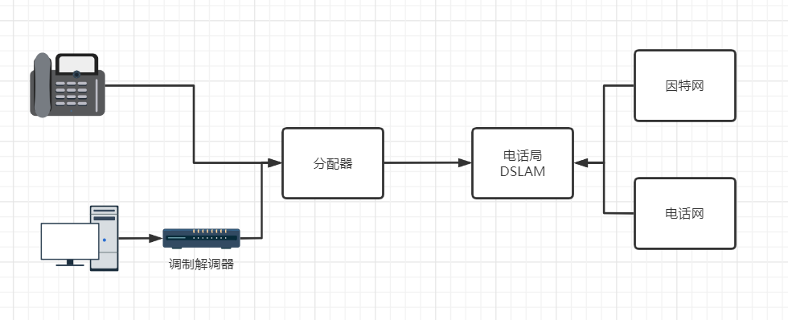

# 1.第一章

## 1.1 什么是因特网?

构成部件: ***互联数十亿计算设备的网络***.  设备称为**主机**或**端系统**. 主机通过**通信链路(由不同的物理媒介组成)**和**分组交换机(路由器)**互相链接, 不同通信媒介有不同的传输速率. 传输速率以`bit/s`或`bps`衡量. 当一台主机向另一台主机发送数据时, 会将数据分段发送, 并为每段加上首部字节, 简称**分组**. 最终在目的地组装. 交换机接受分组, 同时又转发分组. 分组传送的过程就类似于卡车送货, 行驶路径为网络路径, 高速路, 桥类似于通信链路, 分叉路口类似于交换机. 网络由**ISP(因特网服务提供商)**分层提供, 最高层用高速光缆互联. 各部件遵循特定的协议运作.

服务方面: 提供应用程序提供基础服务. 如电子邮件, `Web`冲浪. 应用程序发送数据由端系统提供**套接字接口**供应用程序发送数据. 套接字接口就类似于邮局写信格式, 需要遵守该格式, 信件才能寄出.

**协议**定义了报文发送的格式和顺序, 以及接受和发送后所进行的动作.

## 1.2 接入方式

1. 家庭用户

   1. **数字用户线(DSL)**: 通过使用电话线区分频段进行网络通信. 通过调制解调器处理数据信号(**DSLAM:数字用户线复用器**).

   

## 1.3 分组交换

端系统间交换**报文**, 报文将被划分为多个分组, 每个分组通过通信链路和交换机.

1. 存储转发延时: 多数交换机在开始传输分组之前, 必须接收到整个分组
2. 排队延时: 如果分组到达后, 对应链路繁忙, 则分组将在输出缓存进行等待. 网络拥塞会造成丢包(尽最大努力, 但不保证)

如何知道路由链路? 通过路由选择协议自动设置转发表, 路由选择协议可以决定从路由器到目标地的最短路径, 从而通过最短路径来配置路由器的转发表

## 1.4 电路交换

通过预留资源空间进行数据交换, 优化技术: **频分复用**, **时分复用**

1. 频分复用: 共享频段已节省资源.
2. 时分复用: 利用空闲间隙合理利用资源.

## 1.5 时延 丢包 吞吐量

吞吐量: 每秒能传输的数据量

**时延类型**: 处理时延, 排队时延, 传输时延, 传播时延.

**处理时延:** 检查分组首部, 以决定发送的链路

**排队时延:** 在路由器的报文队列中等待传输的时间.

**传输时延:** 将分组推往链路的时间, 类似于汽车点火启动的状态.

**传播时延:**分组通过链路到达下一步目的地的时间;

分组到达的速度大于传播速度, 则会形成队列, 拥挤.丢包 , windows可以使用`tracert` 命令查看到各个地址的路由路径. `Linux`使用`Traceroute ` ,返回的三个时间是发送时间, 返回时间, 平均时间， `linux`的时间可能为三次往返时间

路由器到服务器的数据, 和服务器到路由器的数据 之间的速率不能太快, 得处于一个均衡状态: 路由器到服务器的速率 > 服务器到路由器的速率.  网络吞吐率不仅受通信链路的速率影响, 同时还有是否有其他数据通过该链路.

## 1.6 协议

**协议分层的理由**: 提供模块化, 使得某层提供的服务易于改变, 只需满足上下层所需的要求即可,  同时其他层次不需求做出改变(类似于接口提供不同实现). 更加灵活, 可以定义不同功能.

**分层的坏处**: 提升运营成本, 升级成本.,增加了复杂性. 同时又可能冗余较低层的功能.

网络都是以分层的方式组织协议和实现这些协议的网络硬件和软件. 某层使用自身的功能或下一层所提供的服务来提供服务.

应用层和运输层通常都是实现于应用中, 而 链路层和物理层通常处于网卡接口中, 网络层则软硬混合.

`OSI`7层模式: 应用层, 表示层, 会话层, 传输层, 网络层, 链路层, 物理层. 表示层的作用就是使应用程序能够解释交换数据的含义. 会话层提供数据交换的定界和同步功能. 为什么要舍弃这两层: 功能应该由应用程序自己决定是否重要. 由应用程序自己实现.

### 1.7 应用层

 包含如: `HTTP(Web文档请求和传送)`,`SMTP(电子邮件报文服务)`,`FTP(文件传送)` , 该层协议分布在端系统中,  该层信息称为**报文**.

### 1.8 传输层

传输层负责传递应用层报文. 包含如: `TCP`，`UDP`, 提供了可靠性链接和拥塞控制. 由操作系统内核实现(也可以说是由应用所处的设备内核实现). 传输的数据称为**报文段**.

### 1.9 网络层

网络层将运输层分组传输到另一台主机中, 该层分组称为**数据报**, 通过运输层报文段和目的地地址, 确定目的地. 主要协议是网际协议`IP`, 也包括决定路由的路由选择协议. 通常称该层为`IP`层.

### 1.10 链路层

链路层将网络层数据在一系列路由器中移动. 链路层分组称为**帧**, 链路层例子如:`Wifi`,以太网

### 1. 11 物理层

物理层就是将链路层的帧一个比特移动到下一个节点, 该层协议还是和链路层相关, 并和物理媒介有关.

## 1. 7 网络安全

**Dos(拒绝服务攻击)**:

1.  弱点攻击: 发送精细的报文使得该服务器停止运行(错误参数).
2. 宽带洪泛: 发送大量的分组, 使得网络拥塞. 单一源容易被检测, 升级为分布式攻击(`DDos`);
3. 连接洪泛: 创建大量的半开或全开TCP连接. 使得无法接受正常连接.

**接收私密分组**: 通过分组嗅探器获取私密分组并重组.

**伪装分组**: 生成分组, 发送到因特网中, 可以修改转发表. 

# 第二章 应用层

进程通过套接字接口发送报文, 进程类似房子, 套接字接口类似于门. 套接字是应用层和运输层之间的接口,  应用层选择运输层有以下几个方面: 可靠数据传输, 吞吐量, 延时, 安全。`SSL`是TCP加强版. 处于应用层.

应用层报文指示了端系统之间的应用如何交换报文. 属于无状态协议

**非持续连接:** 每个请求都用一个单独的TCP连接
**持续连接:**多个请求共享一个TCP连接.(默认)

HTTP一些请求参数: 首条： 方法 `url` `http`版本, host, Connection：表示是否采用持续连接. User-agent: 发送请求的浏览器类型(浏览器内核)， Accept-language:期望返回的内容语法. 通过`if-modifyed-Since` 可以获取最新的缓存内容.

## 2.1 进程寻址

需要目的的两个信息: 1. 目的地地址(`IP`地址)   2. 目的主机的进程编号(套接字, 更具体说是端口号).

## 2. 2 状态码

**`2xx`**: 

1. 200: 请求成功.

**`3xx`**:

1. 301: 请求对象地址已经改变, 新的地址在响应报文的`location`字段中, 客户软件将自动获取新的`URL`

**`4xx`**:

1. 400: 指示请求不能被服务器理解.
2. 404: 资源不存在于服务器

**`5xx`**:

1. 505: 服务器不支持请求报文的HTTP协议版本.

## 2.3` DNS`

`DNS`提供将主机名转换为`ip`地址. 属于应用层协议. 不仅提供`ip`转换, 还有主机别名功能. `DNS`缓存就是本地`DNS`将缓存任意`DNS`服务器的回答(并不是永久的, 通常两天后过期). `DNS`划分为三级(例如`www.baidu.com`):

1. 根`DNS`服务器: 先从这里进行判断, 获取到`.com`, 也就是对应的顶级域的`ip`地址.
2. 顶级域服务器(`TLD`)：顶级域服务器返回`baidu.com`的`ip`地址;
3. 权威`DNS`服务器: 返回`www.baidu.com`的`ip`地址.

`DNS`存储的记录称为资源记录(`RR`), `RR`提供了资源地址到`IP`地址的映射. 可能有一条或多条. RR有以下信息:
(name,value,type,`ttl`):
`ttl`: 指示该记录应当从缓存中删除的时间.
name和value的值取决于type：

type=A: 如果type等于A, 则name为主机名称, value为`ip`地址: (`baidu.com`,129.0.0.12,A,`ttl`);
type=NS: 则name表示域:`baidu.com`, 则value是获取该域的`ip`地址的`dns`主机名
type=`CNAME`:  则name为别名, value对应name的规范名字.
type=`MX`: 则name为别名, value表示邮件服务器name的规范名字.

注册需要向注册登记机构登记域名.

## 2.4 视频流

HTTP流虽然很好, 但是不能自适应带宽, 所以有**经HTTP的动态适应流(DASH)**. 在DASH中, 视频可以编码为多个版本. 通过告示文件获取不同的版本, 告示文件内有`url`和比特率.

单点数据中心容易造成堵塞, 丢包, 同事服务商资源耗费较大。于是有了**内容分发网络(`CDN`)**, 存储文件内容, 用户请求时选择体验较好的`CDN`位置。

`CDN` 就是利用`dns`的`CNAME`进行`cdn`重定向.

# 第三章 传输层

将应用层报文划分成小块, 并加上运输层首部, 生成**报文段**, 传输到网络层。 运输层报文只运行于端系统之中. 即使底层协议不可靠或不安全, 运输层也能保证. 运输层将数据交付给套接字(可能存在多个套接字,每个套接字都有标识符);

`UDP`提供最低的两种服务: 差错检测和数据交付. 不能保证数据完整的到达目的地. 属于不可靠连接.
`TCP`通过使用流量控制, 序号, 确认和定时器提供可靠性服务. 还提供拥塞控制平等共享网络链路宽带.

多路复用和多路分解都需要以下条件: 1.套接字有唯一标识	2. 报文段有区分套接字标识。运输层报文段通过32位的源端口号和目的地端口号报文进行区分. 端口号为0-65535, 0-1023都被大部分应用所使用. [端口列表](www.iana.org) . 源端口号用作返回数据的目的地端口号

`UDP`通过二元组区分(源端口号,目的地端口号)，而`TCP`通过四元组(源`ip`,源端口, 目的地`ip`,目的地端口); 区别在于`UDP`只要目的地端口号一致将发往统一套接字接口, 而`TCP`则需要4个相同

## 3.1 多路分解

将运输层报文段提交到指定的套接字接口称为**多路分解**. 通过检测报文段的目的地端口号决定套接字接口.

## 3.2 多路复用

从不同的套接字中收集数据, 并封装首部属性, 传输到网络层, 称为**多路复用**，将套接字端口写入对应源端口号和目的地端口号.

## 3.3 `UDP`

`UDP`最低限度就是提供分解复用功能. 只是在应用报文附加源`ip`和目的地址和其他的两个小字段, 就交由网络层处理. 在接收方是没有握手的, 因此是无连接的. 

选择`UDP`构建应用的原因:

1. 及时发送: `UDP`不需要进行拥塞控制, 不需要对应用层报文添加额外功能.
2. 无需建立连接: 不会引入建立连接的延迟. (`QUIC`使用`UDP`协议, 并在应用层实现可靠性)
3. 无连接状态: `udp`不需要维护连接状态, 如: 接收和发送缓存. 序号确认。
4. 开销更小: 首部字节内容更少, 仅有8字节.

重压力网络下使用`udp`， 如：电话, 视频, `dns`查询.。 由于缺少拥塞控制, 容易导致高丢包率, 并击垮`TCP`会话.

通过校验和来校验数据是否出现了变化. 长度字段指示`UDP`报文段的长度(字节单位)

### 3.3.1 差错检测

将源端口号, 目的地端口号, 长度的二进制数求和, 然后反码形成校验和, 如果在接收方4个字段相加和全为1, 则数据正确.

`UDP`提供差错检测的原因: 不能保证下层会提供, 做为一层保险措施.

就算出现差错, 也无法修复, 只能丢弃或进行提示.

## 3.4 可靠传输

### 3.4.1 停等协议

一下都是基于*停等协议*: 在没有收到`ACK`分组时, 不能从上层获取数据.

前3步基于分组不丢失的情况下: 

1）完全可靠信道, 无需做任何处理.可靠传输向上层提供一层抽象信道, 借助该抽象信道, 分组不会丢失, 损坏, 并按顺序交付.

2） 数据分组受损的情况下

1.  得让发送方知道那些接收到了, 哪些需要重传.(**自动重传请求协议`ARQ`**)
   1. 差错检测: 提供额外比特的校验和
   2. 接收方反馈: `ACK=1`,`NCK=0`
   3. 重传: 接收到有问题的分组, 发送方将重传.

3）`ack,nck`分组受损情况下?

1. 添加新型分组, 类似'你在说一遍'，缺点: 不过容易导致重复'你在说一遍'
2. 添加足够多的校验和, 不仅可以检测出错, 还可以恢复出错. 缺点: 需要不会丢失分组. 
3. 直接重传当前分组. 缺点: 容易造成分组冗余. 

解决方案: 添加序号字段. 通过序号接收方可以知道该分组是否是重传分组(与最近序号相同),或发送新分组, 发送方则反之. 

4）以上都是未丢包的情况, 接下来考虑丢包:

1. 通过**定时器**判断. 如果在指定时间没收到分组则重传.  但因为网络拥堵, 可能造成**冗余分组**.
2. 发送方不知道是分组丢失, 还是接受方反馈丢失, 还是网络拥堵, 重传往往是更有益的. 

校验和: 校验数据是否出错
`ack,nck`: 接收方反馈是否接收数据.
序号: 处理`ack,nck`受损情况.
定时器: 处理丢包的情况.

### 3.4.2 **优化停等协议**

1. 发送多个分组, 不使用停等协议. 看起来像流水线, 所以称为**流水线技术**.
   1. 需要有唯一序号. 
   2. 发送方和接受方需要缓存多个分组
   3. 所需序号大小和缓存大小, 取决于如何处理异常分组.

流水线解决差错恢复有回退`N`步和选择重传.

### 3.4.3 回退N步

允许发送方发送多个分组, 但是受限于未发送的分组数不能大于窗口长度. 
